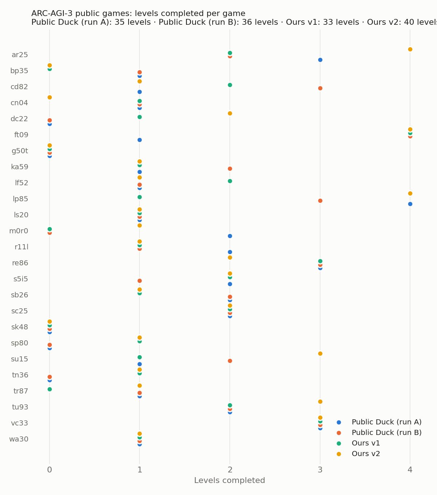

# Fixing the Harness, Not the Model
### What a small team learned auditing, measuring and hardening open ARC-AGI-3 agents

> DRAFT — **[TBD]** marks numbers filled in when pending runs finish.
> Track: ARC-AGI-3. Leaderboard submission: **[TBD: final ID]** (current best 29.28). Code: public notebook **[TBD link]**.

## 1. Summary

Every competitive ARC-AGI-3 entry on Kaggle is the same shape: a small open model (Qwen 3.8 Flash-Next on one RTX Pro 6000) driving a Python tool harness (Tufa Labs' "Duck"). We asked how much of such an agent's behaviour is decided by the harness rather than by the model, and what that means for anyone trying to improve one with a budget of one leaderboard submission per day.

We report three findings.
1. **Harness defects are large and invisible.** Auditing 50 transcripts of the public Duck agent, we found that the model was routinely shown false or incomplete state: a stale "game over" after auto-reset, animation-only mechanics it never saw, ~70% of its memory notes silently dropped by a parser, and a context budget that over-counted images ~25×. Fixing these made three games that scored zero in every reference run complete levels in every one of ours, with the same model.
2. **Offline gains did not transfer.** Our best harness raised the public-game mean from 6.27 to 8.85, but every version scored within ±0.5 of each other on the hidden leaderboard (3.33–3.66). Public games are too few and too different to select harness changes.
3. **The binding risk at the top is reliability, not reasoning.** After adopting the strongest public solution (Daniel Franzen's Milestone-2 notebook) we scored 29.28; resubmitting the *identical* notebook scored **0.00**. Model-weight loading took 1,779 s instead of 321 s on that machine, and every game exhausted its connection grace period before the server came up. A one-line change makes the agent tolerate this. **[TBD: score of the hardened version]**

## 2. Setting

Each ARC-AGI-3 game is a 64×64, 16-colour interactive environment with hidden rules and several levels. Score per level is min(1, human_actions / agent_actions)², weighted by level. Kaggle runs 110 hidden games in 9 hours on one GPU, offline. The Duck exposes the game to the model as Python variables plus an `action(...)` function, attaches a board image to each turn and keeps a rolling context.

## 3. Part I — Auditing the public harness

We parsed the transcripts and benchmark records of two public reference runs (25 games each) and measured, per game, levels, actions vs. human baseline, LLM calls and latency, the presence of the carried memory note, and every harness message shown to the model. For the five games that scored zero in both runs we compared the model's stated beliefs with the game source.

1. **The binding constraint is LLM calls, not actions.** Each game used its whole 132-min budget on ~55 calls; on levels it solved, the agent matched human action counts (median 0.82–0.88×). 61–64% of time went to the final, never-solved level.
2. **Stale terminal state.** After auto-reset the next prompt still said "The game is over." (207 prompts), while the system prompt says to stop on game over; one run of dc22 idled for 65 min.
3. **Invisible mechanics.** Only the last frame of each action was kept. In sp80 an effect visible only mid-animation led the model to conclude "SPACE is a no-op". Animation-only effects occur in 12 of 25 games.
4. **Lost memory.** The note parser matched only the literal `World model:`; the model wrote `World model (revised):`, so the carried model was empty on 47–49% of turns, and it was also wiped at every level transition.
5. **Context mis-budgeting.** Images were counted by base64 length (~2.5k "tokens" instead of ~100), so the 32k window held ~8 calls; a 60 s turn budget shorter than one LLM call re-sent the full prompt nearly every turn.

We fixed each defect without game-specific logic (truthful terminal state, an animation summary, tolerant note parsing, knowledge carry-over across levels, fixed vision-token cost, a longer turn budget with progress nudges) and added a compute reallocation rule (stop games stalled after their first level).

| Run (public 25 games) | Mean | Levels | 0-level games |
|---|---|---|---|
| Public Duck, runs A / B | 5.78 / 6.76 | 35 / 36 | 5 / 6 |
| Ours v1 (fidelity fixes) | 6.25 | 33 | 5 |
| Ours v2 (+ turn budget, nudges), 2 runs | 8.04 / 6.77 | 40 / 36 | 4 / 5 |
| Ours v3 (+ drop past reasoning) | 5.71 | 31 | 6 |
| Ours v4 (+ stall stop at 75 min) | 7.02 | 30 | 8 |
| Ours v5 (stall stop only after level 1), 2 runs | 10.34 / 7.35 | 44 / 39 | 3 / 2 |

Robust per-game effects: sp80, tn36 and dc22 complete levels in every one of our runs and in no reference run; in sp80/tn36 the new animation evidence appears in 23 and 26 prompts. Negative results: dropping past reasoning from history (v3) lost continuity; a blanket stall stop (v4) killed slow first levels.

## 4. Part II — Why it did not show on the leaderboard

| Version | Public-25 mean | Hidden LB |
|---|---|---|
| v1 | 6.25 | 3.42 |
| v2 | 7.41 (2 runs) | 3.66 |
| v5 | 8.85 (2 runs) | 2.53 |
| v6 (v5, extensions off) | — | 3.33 |
| v6 + fine-tuned model (Swift 1.5) | 7.32 | 2.23 |

All harness versions sit within the leaderboard's run-to-run noise, and the ordering is not preserved. Two causes are visible in our data. First, the public evaluation runs 25 games in one wave while the hidden run plays 110 in four, so scheduling rules behave differently (v5's progress extensions never fired offline and lengthened waves online). Second, both evaluations are small samples of a high-variance process (±1.5 public, ±0.5 LB at this score level). The practical lesson for anyone with one submission a day: a harness change needs either a mechanism visible in transcripts (as in §3) or many runs, and a single offline run selects noise.

## 5. Part III — Reliability at the top

On 30 September Franzen published his Milestone-2 solution (LB 27.24): the same Duck lineage with a ~5k-line harness patch, a 4-bit Intel AutoRound quantisation served by an SGLang fork with MTP speculative decoding, a 128k context with the structured memory removed, and a priority scheduler over all 110 games. It already contains equivalents of our §3 fixes. We forked it (credited; unchanged otherwise) and scored **29.28** (rank 59 of 3,585), in a cluster of forks spanning ~26–32.

Resubmitting the identical notebook scored **0.00**. Our own test run started in the same hour logged a weight load of **1,779 s** versus 321 s two days earlier. The notebook releases games after 12 minutes so that the gateway sees activity, and each game's first request retries for at most 900 s; with a ~35-minute server start, every game exhausted its retries and played nothing. We also found that one more speculative step (a natural throughput knob) is rejected outright by the model's sparse-attention kernel (`draft tokens ≤ 4`), so throughput is already at the configuration's limit.

Fix: extend the first-request grace to 3,600 s. It costs nothing when the server is fast — the grace applies only while the first request fails — and covers loads up to ~70 minutes. **[TBD: LB of hardened version, and number of reruns without a zero.]** Because the final ranking reruns the selected notebook on private games, a zero from infrastructure is the single largest expected loss for any team in this cluster, larger than any harness tweak we measured.

## 6. Discussion

The same lesson appears at both ends of the leaderboard. At 3 points, the agent fails because the harness tells the model false things about its world; at 29 points, it fails because the harness assumes the infrastructure behaves the same twice. In both cases the model is not the bottleneck, the defects are invisible in aggregate scores, and they are found only by reading logs and transcripts against ground truth. We think this generalises to any tool-using agent: audit what the model is shown and what the harness assumes before tuning prompts or models.

## 7. Limitations

Few runs per configuration; per-game mechanism evidence is our main support. The 0.00 diagnosis is inferred from a concurrent test run, since competition rerun logs are not visible to participants. The Franzen-based results reuse another team's work, credited above; our contributions are the audit, the transfer analysis and the reliability fix.

## Acknowledgements

Tufa Labs (Duck harness, MIT); Daniel Franzen (Milestone-2 solution); Intel, Albucino and the Pennyroyal SGLang contributors; the Qwen team.
